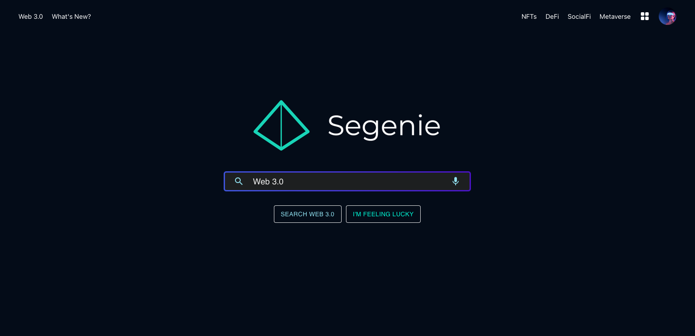

# Segenie


Segenie is a project inspired by the recent publication of Decentralized Society: Finding Web3's Soul, written by lawyer Puja Ohlhaver, E. Glen Weyl, an economist and social technologist, and Ethereum co-founder Vitalik Buterin.

**Soulbound Tokens (SBTs)** : Access to premium websites, content, or communities. These soulbound tokens (SBTs) will have a wide array of purposes and will be held by unique crypto wallets called Genies.

**Badges** : Creators and Users will be able to distribute or gain soulbound NFTs with anything linked/accomplished in the real or digital world (Web 3). _One example being the acquisition and storage of achievements, items, winnings, feedback, acquirements, and accomplishments received in all the Metaverses._

The Segenie browser is going to consist of two canisters on the Internet Computer(IC). In the following sections we are going to explain how these two components are going to interact with each other.



### Frontend canister

The frontend is written in React and it is going to allow users to browse the Segenie browser. It is going to query any additional information from the backend that we add like the achievements of the user.

The frontend is also going to have a very important job for website restrictions, but more about that in the following sections.

### Backend canister

The backend canister is going to store the information about the users of Segenie. It will store their username(unique), name, bio, and virtual wallet (Soul/Genie). Also this canister is going to store the users soulbound tokens that they possess.

Each soulbound token is going to have the following information stored in the canister:

```
id - an unique identifier for the achievement

name - the name of the achievement

description - the description of the achievement

issuer - the creator of the soulbound token
```

_Note this will be changed a bit in the future, since we may add some additional fields or make additional changes._

### Images
You may notice that in the listed information we don’t mention the image for the SBTs. That is because we have a decision to make about that. The images can be stored on IPFS, in which case we would need an additional file in the SBT for the CID. The other option is to store the images directly on the IC.

We can make this decision later during the development of the project because we can start off by working without them, and then later down the road add the images before we release the first alpha version.

### Non-Transferable Soulbound Tokens(SBTs) + Badges
For now one of the main ideas of SBTs is to restrict access to certain websites/content/data/etc to only people that have the required Badges or SBTs. The decision of who can access the website needs to be made by the website or data owners. They have to define the rules about accessing their website or data.

We have tought of multiple ways to achieve this, but the following is the best solution that we have found.

### Restricting certain websites or data to certain users/wallets
We are going to store information about restrictions of the certain websites or data on the  IC. For this we are going to add additional endpoints to the backend canister. So it will look like the following:

_website_domain - the domain of the website is going to be the key for searching the required soulbound tokens_
_soulbound tokens - this is going to be a vector of different achievements/affiliations/memberships/etc that the user must have to acces the website_

###EXAMPLE - Access Tokens for Certian Websites

**But how are we going to verify that this is set by the website or data owner?**
We are going to use an approach that is very frequently used for domain verification.
In the DNS settings of all websites there is a TEXT field. This field is mostly used for domain ownership verification. So we are going to request from the domain owner to put their _principal_ in the TEXT field, so that we can verify that the user who wants to make the restrictions is actually the website owner. Also we will require the developers of the website to add a new meta tag to their html, so that we also verify the ownership of the website.

**But how do we restrict the access?**
It is simple from now on to restrict the access. All we need to do is query the requested acheivements for the website the user is trying to access. The other information we need is the achievements of the user that we will get by querying the backend cansiter. Now all we need to do is make a simple check whether the user has the requested achievements.

**The problem with this solution**
This way the access will be restricted only if the users visit the website on Segenie, if they visit it using any other browser the access will not get restricted. Currently we have an idea for fixing this issue, but before adding it to this document, we have to make sure it works.

**High level visual representation of a user visiting a website while utilizing this solution**


### NPM package

The npm package is another way to restrict access to a website. It would have the job of querying the soulbound tokens for a certain user. It should have a function that could take the principal of the user that is trying to access the website and return the soulbound tokens or badges of the user.

The idea in pseudo code would look like the following:

```js
// Import the npm package.
import segenie

// this can be got from an IC wallet
let userPrinciple = getUserPrinciple()

// this is going to be defined by the website developer.
// e.g. it requires badge that is earned from participating in the supernova hackathon.
let requiredAchievement = getRequiredAchievement();

// the npm package will have this one function for getting the achievements
// of the given principal(this will query the backend so that it gets the list of achievements).
let achievements = segenie.getAchievements(principal);

// Check if the achievements list contains the required achievement.
// If so then continue with the website execution, i.e. send the website in response to the user.
// Else send back a custom page that says the user doesn’t have the requested achievement.

// End of the code
```
**PROS of this solution**

This solution has something that the first one can't really achieve. It gives the developers freedom. The npm package only gives you the achievements of the person that is trying to access the website. You don't have to restrict the website to them, you can implement any kind of logic for restricting certain features of the websites. For example such feature could be that the user is not allowed to comment(of cource you can only do this if your website has a commenting feature). There is really no limit to the possibilites here.
